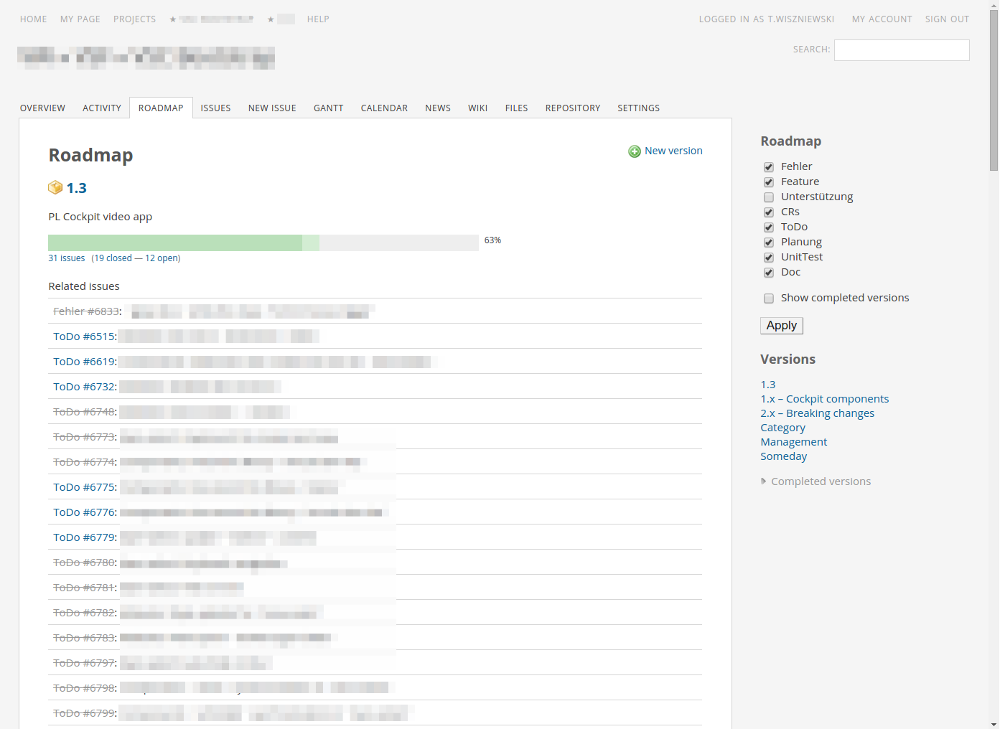

[![Install from stylebot][shield]][social]

Cleaner Redmine
===============

**Make [Redmine][] digestible.**

[][social]

The default look of [Redmine][] makes it difficult to find important info. This set of CSS overrides improves the ugliest bits of Redmine.

Here’s what you get:

* more air, less cramp
* less visual clutter
* pleasing aesthetics

[Redmine]:  http://www.redmine.org/
[shield]:   https://img.shields.io/badge/stylebot-install%20now-orange.svg?style=flat-square
[social]:   http://stylebot.me/styles/10068

Usage
-----

I’ve found no tool for Chrome to pull a custom stylesheet from the filesystem and apply it to specific pages.

The least annoying thing I’ve found is [stylebot][]. You can [install this style][social] from their styles repository – I do my best to keep it up to date.

[![Install from stylebot][shield]][social]

[stylebot]:  https://github.com/ankit/stylebot

Compatibility
-------------

Honestly speaking, I have no idea what version of Redmine this is compatible with. I just keep it up-to-date with my install.

License
-------

[MIT][] © [Tomek Wiszniewski][]

[MIT]:                ./License.md
[Tomek Wiszniewski]:  https://github.com/tomekwi
